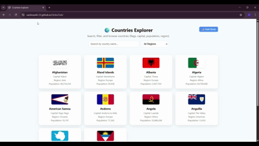

# 🌍 GlobeTrek  

**Objective:** An interactive web app to explore countries with **search, filter, pagination, and flags**.  

---

## ✨ Features  
- 🌐 Fetches real-time country data from the **REST Countries API**  
- 🔍 **Search** with highlighted matches  
- 🗂️ **Filter by region** for easy navigation  
- 📄 **Pagination** (10 countries per page)  
- ⏳ **Skeleton loader** while fetching data  
- 🌙 **Dark mode toggle** for better user experience  
- 📱 **Responsive design** across devices  

---

## 🛠 Tech Stack  


---

## 🚀 Live Demo  
🔗 [GlobeTrek Live](https://vaishnaviiii-23.github.io/GlobeTrek)  

---

## 🎥 Demo  


 

---

## 📂 Project Structure  

```bash
GlobeTrek/
├── index.html
├── style.css
├── script.js
└── README.md

## 🤝 Contributing

Contributions, issues, and feature requests are welcome!

Feel free to fork this repo and submit a pull request.

## ⭐ Show your support

If you like this project, give it a star ⭐ to support the development.